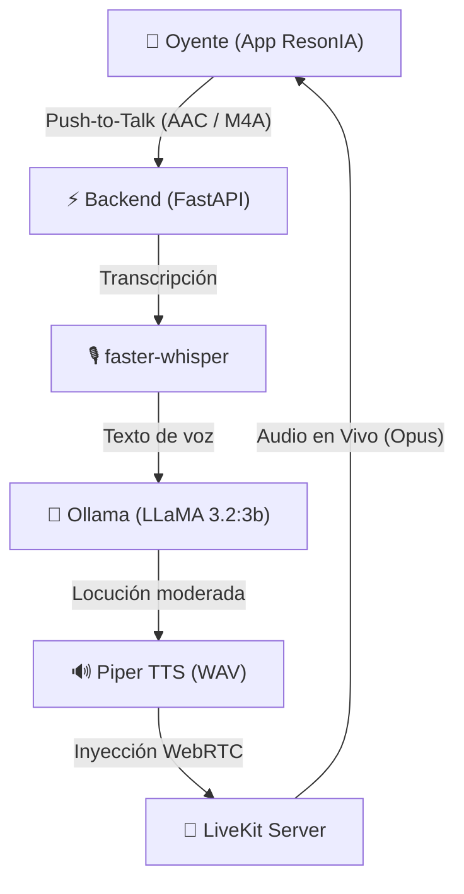

# ResonIA 🎙️🤖

**ResonIA** es una aplicación multiplataforma (iOS y macOS) desarrollada en SwiftUI, integrada con una cabina de radio interactiva impulsada por Inteligencia Artificial local y transmisión de audio WebRTC de ultra-baja latencia.

Permite a los oyentes interactuar con una cabina inteligente mediante notas de voz (Push-to-Talk). La IA procesa, modera, sintetiza y emite la respuesta al aire directamente en la sala virtual.

---

## 🏛️ Arquitectura del Sistema



1. **Frontend (SwiftUI & AVFoundation):**
   - Interfaz con selector Push-to-Talk táctil.
   - Medición de potencia en decibelios y temporizador en tiempo real.
   - Sintonización automática WebSockets a través del SDK oficial de LiveKit.

2. **Backend Orquestador (FastAPI & Python):**
   - Validación y recepción de notas de voz multipart.
   - **Speech-to-Text:** `faster-whisper` (modelo `base`, cuantización `int8`).
   - **Moderación y Redacción Radial:** `Ollama` (`llama3.2:3b`).
   - **Text-to-Speech:** `Piper TTS` (voz neural `es_ES-davefx-medium`).
   - **Streaming WebRTC:** Inyección continua de audio en bloques PCM de 20 ms hacia la sala `cabina-resonia`.

---

## 🚀 Requisitos y Configuración Rápida

### 1. Servidor LiveKit
Inicia el servidor local de LiveKit:
```bash
livekit-server --dev
```

### 2. Modelo de Lenguaje en Ollama
Asegúrate de tener en ejecución el modelo LLaMA:
```bash
ollama run llama3.2:3b
```

### 3. Backend de Cabina (Python)
Consulta la guía detallada en [`backend/README.md`](backend/README.md) para configurar el entorno virtual, las variables de entorno (`.env`) y los modelos de voz.

```bash
cd backend
python3 -m venv venv
source venv/bin/activate
pip install -r requirements.txt
uvicorn server:app --host 0.0.0.0 --port 8000 --reload
```

### 4. Cliente iOS / macOS (Xcode)
1. Abre `ResonIA.xcodeproj` en **Xcode 16+**.
2. Selecciona el esquema `ResonIA` y el destino deseado (Mac o iPhone).
3. Presiona **⌘R** para compilar y ejecutar.
4. Mantén presionado el botón central de micrófono para enviar tu mensaje a la cabina.

---

## 🔒 Seguridad y Buenas Prácticas

- **Protección de Credenciales:** Las claves de API y secretos de LiveKit se configuran exclusivamente mediante variables de entorno o archivos `.env` (ignorados por Git).
- **Validación de Archivos:** El endpoint de audio restringe estrictamente extensiones (`.m4a`, `.wav`, etc.) y limita el tamaño de archivo a 15 MB para mitigar ataques de denegación de servicio (DoS).
- **Sanitización de Entradas:** Los parámetros de consulta (`identity`, `name`) son filtrados contra inyecciones y caracteres no imprimibles.
- **Acceso a Hardware:** La aplicación implementa permisos asíncronos para el micrófono conforme a las directrices de Apple.

---

## 📄 Licencia
Este proyecto es software privado desarrollado para **ResonIA**.
